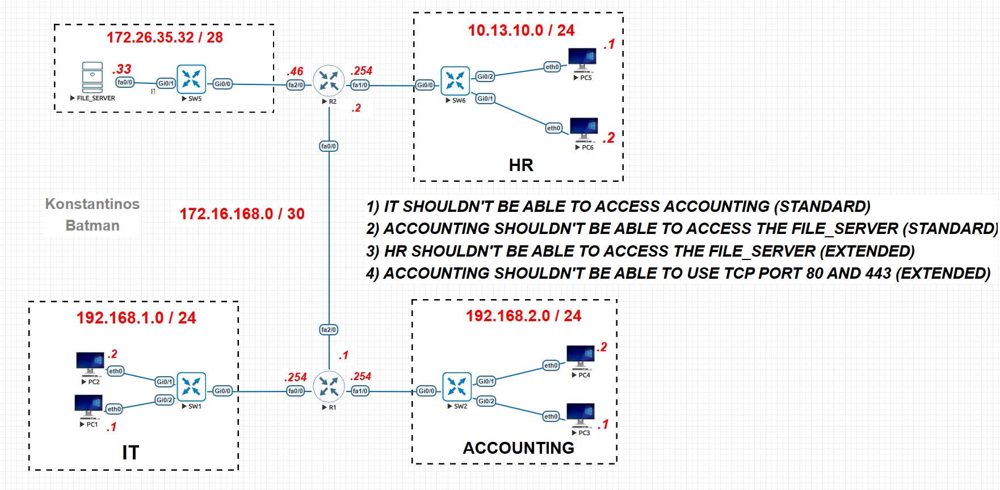
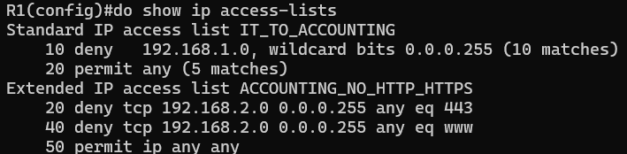
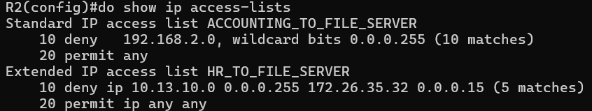

# ACL LAB IN *EVE-NG*



# Overview

This project demonstrates the configuration and verification of **Standard** and **Extended** Access Control Lists (ACLs). 

---

### IP Addressing Schema
| Segment | Subnet | Wildcard Mask | Gateway |
| :--- | :--- | :--- | :--- |
| **IT Department** | `192.168.1.0 /24` | `0.0.0.255` | `.254` |
| **Accounting** | `192.168.2.0 /24` | `0.0.0.255` | `.254` |
| **HR Department** | `10.13.10.0 /24` | `0.0.0.255` | `.254` |
| **File Server** | `172.26.35.32 /28` | `0.0.0.15` | `.46` |

---

## Lab Goals & Security Policies
The following business requirements were implemented:

1.  **IT Restriction:** IT should not be able to access the Accounting network (**Standard ACL**).
2.  **Accounting File Access:** Accounting should not be able to access the File Server (**Standard ACL**).
3.  **HR File Access:** HR should not be able to access the File Server (**Extended ACL**).
4.  **Web Filtering:** Accounting should be blocked from using HTTP (80) and HTTPS (443) (**Extended ACL**).

---

## ACL Configuration on ***R1*** (Blocking access for IT to Accounting)
```shell
R1(config)# ip access-list standard IT_TO_ACCOUNTING
R1(config-nacl-std)# deny 192.168.1.0 0.0.0.255
R1(config-nacl-std)# permit any
R1(config)# int fa1/0
R1(config-if)# ip access-group IT_TO_ACCOUNTING out
```
## ACL Configuration on ***R1*** (Blocking HTTP and HTTPS for Accounting)
```shell
R1(config)# ip access-list extended ACCOUNTING_NO_HTTP_HTTPS
R1(config-nacl-ext)# deny tcp 192.168.1.0 0.0.0.255 any eq 80
R1(config-nacl-ext)# deny tcp 192.168.1.0 0.0.0.255 any eq 443
R1(config-nacl-ext)# permit ip any any
R1(config)# int fa1/0
R1(config-if) ip access-group ACCOUNTING_NO_HTTP_HTTPS in
```
 

- *note that www is port 80*

## ACL Configuration on ***R2*** (Blocking access for Accounting to the File Server)
```shell
R2(config)# ip access-list standard ACCOUNTING_TO_FILE_SERVER
R2(config-nacl-stnd)# deny 192.168.2.0 0.0.0.255
R2(config-nacl-stnd)# permit any
R2(config)# int fa2/0
R2(config-if)# ip access-group ACCOUNTING_TO_FILE_SERVER out
```

## ACL Configuration on ***R2*** (Blocking access for HR to the File Server)
```shell
R2(config)# ip access-list extended HR_TO_FILE_SERVER
R2(config-nacl-ext)# deny ip 10.13.10 0.0.0.255 ip 172.26.35.32 0.0.0.15
R2(config-nacl-ext)# permit ip any any
R2(config)# int fa2/0
R2(config-if)# ip access-group HR_TO_FILE_SERVER in
```


