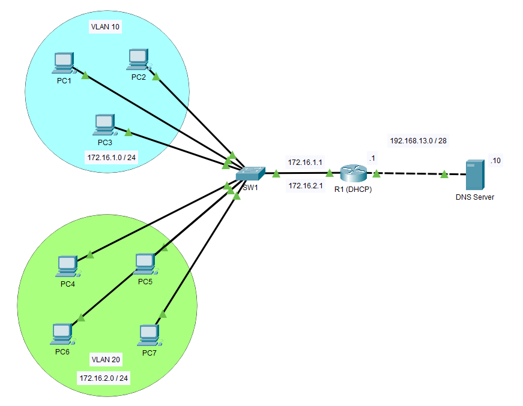

### DHCP & DNS Lab

## Topology Overview

- **Switch (SW1)** with two VLANs:
  - VLAN 10 (172.16.1.0/24): PC1, PC2, PC3
  - VLAN 20 (172.16.2.0/24): PC4, PC5, PC6, PC7
- **Router (R1)** acting as the **DHCP server** and **default gateway**
- **DNS Server** on network `192.168.13.0/28` with IP `192.168.13.10`

## Configuration Summary

### DHCP Setup (on Router R1)

R1 provides dynamic IP addressing for two VLAN subnets:

- **VLAN 10 (172.16.1.0/24)**
  - Excluded: `172.16.1.1` (gateway)
  - Pool: `VLAN10`
  - Default Router: `172.16.1.1`
  - DNS Server: `192.168.13.10`

- **VLAN 20 (172.16.2.0/24)**
  - Excluded: `172.16.2.1` (gateway)
  - Pool: `VLAN20`
  - Default Router: `172.16.2.1`
  - DNS Server: `192.168.13.10`

### DNS Setup

- DNS Server IP: `192.168.13.10`
- Hostnames mapped (example):
  - `PC1` → `172.16.1.2`
  - `PC7` → `172.16.2.4`

### VLAN and Interface Configuration

- **SW1** handles VLAN segmentation
- Router-on-a-Stick method is assumed:
  - Sub-interfaces on R1 for inter-VLAN routing
    - `R1 Gig0/0.10` – `172.16.1.1`
    - `R1 Gig0/0.20` – `172.16.2.1`

## Verification Steps

PCs successfully receive IP addresses via DHCP
PCs can ping the default gateway and DNS server
Domain names resolve correctly using the DNS server
Inter-VLAN routing works between VLAN 10 and VLAN 20

- Feel free to use or modify this lab setup for your own practice.

