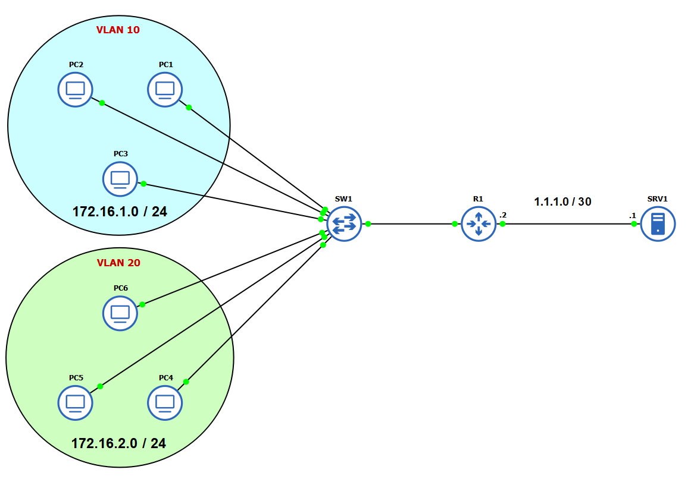
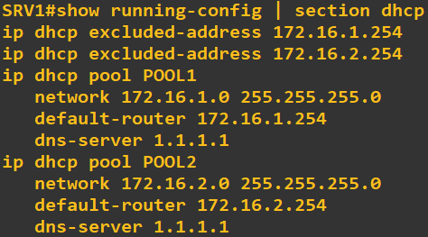
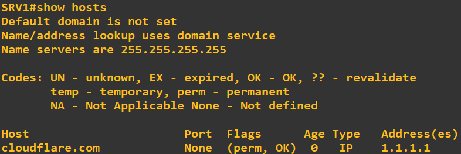
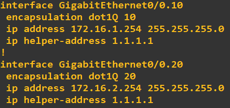
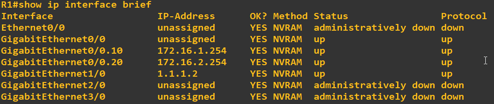

# DHCP & DNS GNS3 Lab

This GNS3 lab demonstrates the configuration of DHCP and DNS services using a Cisco router (`SRV1`) to serve two VLANs. It includes basic inter-VLAN routing and end-to-end connectivity for client devices.



## Topology Overview

- **SRV1 (Cisco Router)**  
  - Provides **DHCP** and **DNS** services.
  - IP: `1.1.1.1/30`

- **R1 (Router)**  
  - Acts as a gateway between VLANs and the server.
  - IP: `1.1.1.2/30`

- **SW1**  
  - Manages VLAN segmentation and port-based assignments.
  - VLAN Trunk port configured towards `R1`.

- **VLAN 10 (172.16.1.0/24)**  
  - PCs: PC1, PC2, PC3

- **VLAN 20 (172.16.2.0/24)**  
  - PCs: PC4, PC5, PC6

##  Goals

- Dynamically assign IP addresses to PCs in both VLANs using DHCP.
- Enable name resolution for clients using the DNS service.
- Establish connectivity between VLANs and the server.
- Practice DHCP, DNS, and inter-VLAN routing concepts.

## Important Configuration

### SRV1 (DHCP & DNS Server)
```
ip dhcp pool VLAN10
   network 172.16.1.0 255.255.255.0
   default-router 172.16.1.254
   dns-server 1.1.1.1

ip dhcp pool VLAN20
   network 172.16.2.0 255.255.255.0
   default-router 172.16.2.254
   dns-server 1.1.1.1

ip dns server
ip domain lookup
ip host cloudflare.com 1.1.1.1
```


### R1 
```
interface g0/0.10
 encapsulation dot1Q 10
 ip address 172.16.1.254 255.255.255.0
 ip helper-address 1.1.1.1

interface g0/0.20
 encapsulation dot1Q 20
 ip address 172.16.2.254 255.255.255.0
 ip helper-address 1.1.1.1
```




