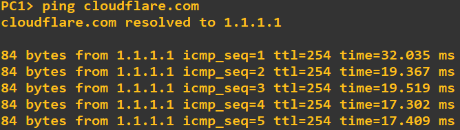

# DHCP & DNS GNS3 Lab

This GNS3 lab demonstrates the configuration of DHCP and DNS services using a Cisco router (`SRV1`) to serve two VLANs.


---

## Important Configuration

### SRV1 (DHCP & DNS Server)
```
ip dhcp pool VLAN10
   network 172.16.1.0 255.255.255.0
   default-router 172.16.1.254
   dns-server 1.1.1.1

ip dhcp pool VLAN20
   network 172.16.2.0 255.255.255.0
   default-router 172.16.2.254
   dns-server 1.1.1.1

ip dns server
ip domain lookup
ip host cloudflare.com 1.1.1.1
```


---

## R1 
```
interface g0/0.10
 encapsulation dot1Q 10
 ip address 172.16.1.254 255.255.255.0
 ip helper-address 1.1.1.1

interface g0/0.20
 encapsulation dot1Q 20
 ip address 172.16.2.254 255.255.255.0
 ip helper-address 1.1.1.1
```


---

## Verification

- Use `ip dhcp` on the PC's to acquire an IP address from the DHCP.
- Use `ping clouflare.com` pm the PC's to test the DNS queries.
- Use `show ip dhcp binding` on the Server to list all of the DHCP leases.



---

## Feel free to clone this project and modify the configurations to fit your own scenarios.
