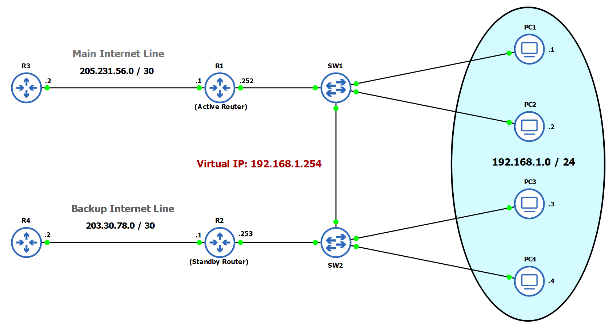
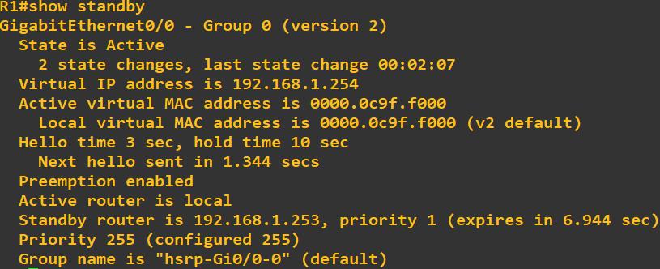

# HSRP Lab



## Overview

This lab demonstrates Hot Standby Router Protocol (HSRP) configuration for providing high availability in a network. 
Two routers (R1 and R2) are configured in an HSRP group to provide gateway redundancy for a LAN segment.

## HSRP Configuration
### R1 (Active Router)
```
interface GigabitEthernet0/0
 ip address 192.168.1.253 255.255.255.0
 standby 1 ip 192.168.1.254
 standby 1 priority 255
 standby 1 preempt
interface GigabitEthernet0/1
 ip address 203.30.78.1 255.255.255.252
 exit
ip route 0.0.0.0 0.0.0.0 203.30.78.2
```


---

### Main Internet Line Router
```
interface GigabitEthernet0/0
 ip address 203.30.78.2 255.255.255.252
 exit
ip route 192.168.1.0 255.255.255.0 203.30.78.1
```

---

### R2 (Standby Router)
```
interface GigabitEthernet0/0
 ip address 192.168.1.252 255.255.255.0
 standby ip 192.168.1.254
interface GigabitEthernet0/1
 ip address 205.231.56.1 255.255.255.252
 exit
ip route 0.0.0.0 0.0.0.0 205.231.56.2
```


---

## Verification

- Use `show standby` on routers to confirm standby settings.
- Use `show ip interface brief` on R1 and R2 to verify all interfaces are up and assigned correctly.
- Ping from all PC's to the active router and standby router.

---

## **Thank you for reviewing this project.** 
For questions, suggestions, or improvements, feel free to contribute or open an issue.
