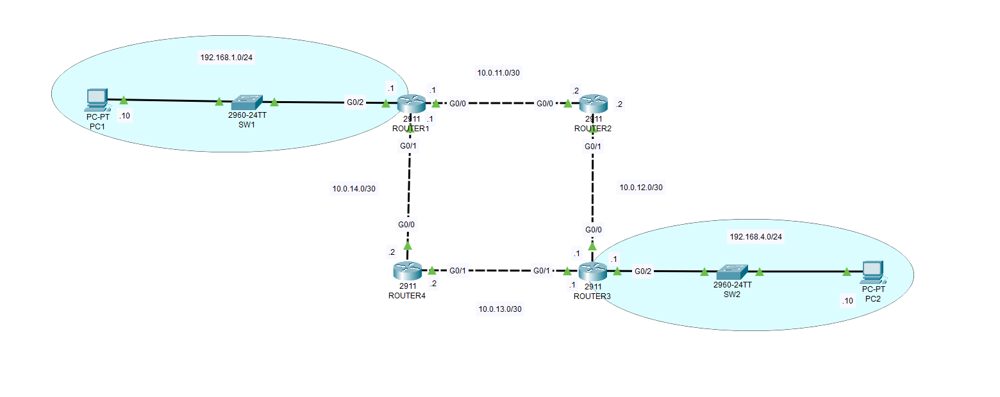

# OSPF Lab



- This is a practical OSPF lab designed to demonstrate basic OSPF configuration, neighbor formation, and route advertisement across four routers whilst 
also connecting 2 end hosts (PCs) on different networks that are connected through the routers. 
- The end goal is for the 2 end hosts to be able to **communicate with eachother**.

## Network Topology & Addressing

| Device   | Interface | IP Address        | Notes             |
|----------|-----------|-------------------|-------------------|
| **Router 1** | G0/0      | 10.0.11.1/30      | Link to Router 2  |
|          | G0/1      | 10.0.14.1/30      | Link to Router 4  |
|          | G0/2      | 192.168.1.1/24    | LAN, Passive Interface |
|          | Router ID | 1.1.1.1           |                   |
| **Router 2** | G0/0      | 10.0.11.2/30      | Link to Router 1  |
|          | G0/1      | 10.0.12.2/30      | Link to Router 3  |
|          | Router ID | 2.2.2.2           |                   |
| **Router 3** | G0/0      | 10.0.12.1/30      | Link to Router 2  |
|          | G0/1      | 10.0.13.1/30      | Link to Router 4  |
|          | G0/2      | 192.168.4.1/24    | LAN, Passive Interface |
|          | Router ID | 3.3.3.3           |                   |
| **Router 4** | G0/0      | 10.0.14.2/30      | Link to Router 1  |
|          | G0/1      | 10.0.13.2/30      | Link to Router 3  |
|          | Router ID | 4.4.4.4           |                   |
| **PC1**  | FA0/1       | 192.168.1.10/24   | Default Gateway: 192.168.1.1 |
| **PC2**  | FA0/1       | 192.168.4.10/24   | Default Gateway: 192.168.4.1 |


##  Configuration Highlights

- All routers are configured in OSPF backbone area 0 for simplicity and to maintain proper OSPF design.
- OSPF is configured on all routers with router IDs set explicitly.
- Point-to-point links use /30 subnets between routers.
- LAN interfaces (`G0/2` on Router 1 and Router 3) are configured as **passive interfaces** to prevent OSPF neighbor formation on those LAN ports while still advertising the connected networks.
- PCs connected to the LAN subnets can ping across the network through OSPF routing.

## Key Commands Used
- ROUTER 1 Configuration

```
router ospf 1
network 10.0.11.0 0.0.0.3 area 0
network 10.0.14.0 0.0.0.3 area 0
network 192.168.1.0 0.0.0.255 area 0
router-id 1.1.1.1
passive-interface G0/2
```

- ROUTER 2 Configuration

```
router ospf 1
network 10.0.11.0 0.0.0.3 area 0
network 10.0.12.0 0.0.0.3 area 0
router-id 2.2.2.2
```

- ROUTER 3 Configuration

```
router ospf 1
network 10.0.12.0 0.0.0.3 area 0
network 10.0.13.0 0.0.0.3 area 0
network 192.168.4.0 0.0.0.255 area 0
router-id 3.3.3.3
passive-interface G0/2
```

- ROUTER 4 Configuration

```
router ospf 1
network 10.0.14.0 0.0.0.3 area 0
network 10.0.13.0 0.0.0.3 area 0
router-id 4.4.4.4
```

## Verification

- Use `show ip ospf neighbor` on routers to confirm OSPF adjacencies.
- Use `show ip route ospf` to check learned routes.
- From PC1, ping PC2’s IP address to verify end-to-end connectivity.
- Similarly, ping back from PC2 to PC1.

### Feel free to clone this project and modify the configurations to fit your own scenarios. Experimentation is key to mastering OSPF and networking in general!
