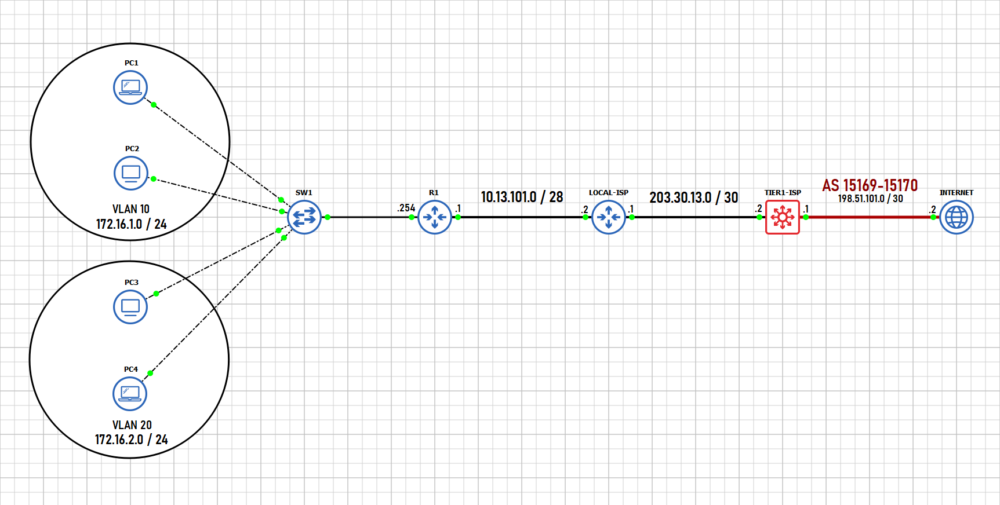
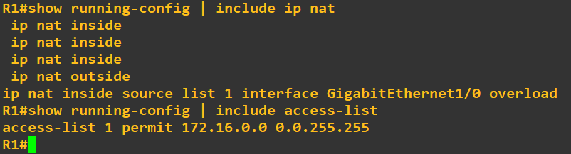
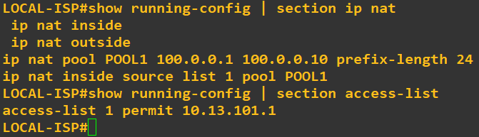
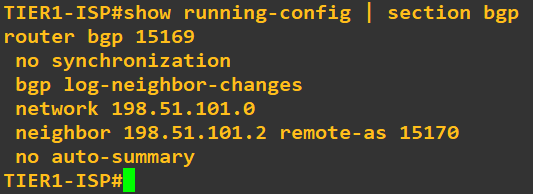
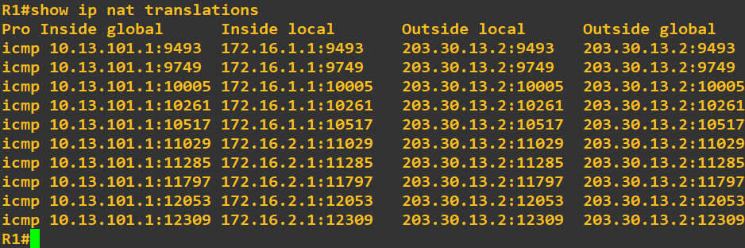
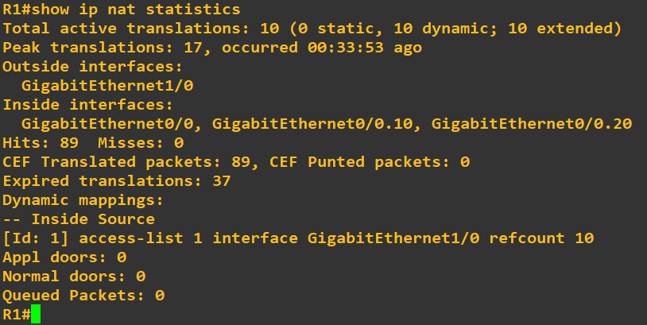
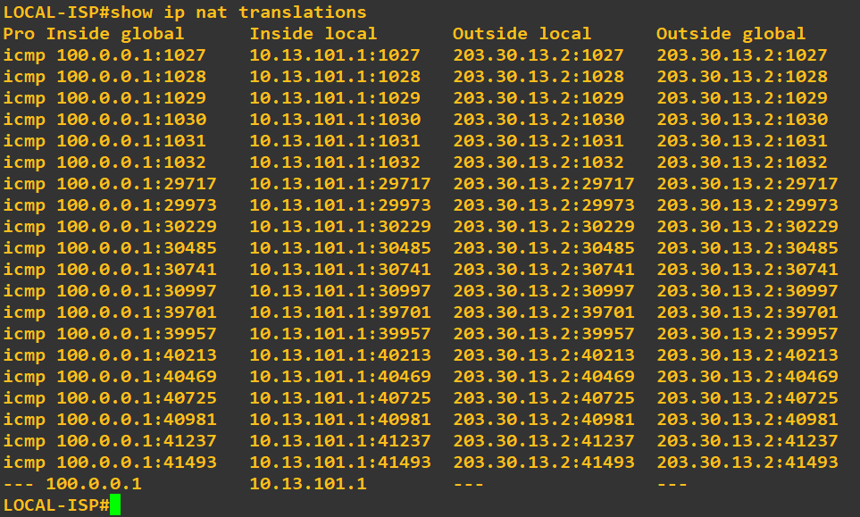
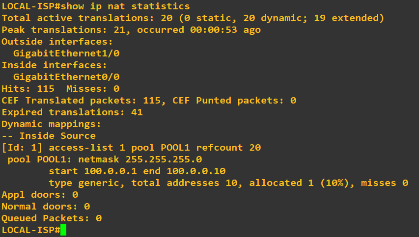

# PAT & Dynamic NAT Lab



This project demonstrates a multi-tier NAT (Network Address Translation) setup using GNS3. It includes both **PAT (Port Address Translation)** at the enterprise edge and **Dynamic PAT** using an IP pool at the ISP level. This is a hands-on lab to help you understand NAT behaviors in enterprise-to-internet routing scenarios.

---

## Lab Overview

- Internal users (PC1-PC4) reside in separate VLANs.
- Traffic from internal VLANs is translated using PAT on **R1**.
- The **LOCAL-ISP** performs **dynamic PAT** using a pool of public IPs.
- The **TIER1-ISP** connects to a simulated **Internet**.

---


## Configuration

### R1 - PAT Configuration

```
interface G0/0.10
  encapsulation dot1q 10
 ip address 172.16.1.254 255.255.255.0
 ip nat inside

interface Gig0/0.20
  encapsulation dot1q 20
 ip address 172.16.2.254 255.255.255.0
 ip nat inside

interface Gig0/1
 ip address 10.13.101.1 255.255.255.240
 ip nat outside

access-list 1 permit 172.16.0.0 0.0.255.255
ip nat inside source list 1 interface Gig1/0 overload
```

---



### LOCAL-ISP - Dynamic PAT with Pool
```
interface Gig0/0
 ip address 10.13.101.2 255.255.255.240
 ip nat inside

interface Gig1/0
 ip address 203.30.13.1 255.255.255.252
 ip nat outside

access-list 1 permit 10.13.101.1
ip nat pool POOL1 100.0.0.1 100.0.0.10 prefix-length 24
ip nat inside source list 1 pool POOL1
```

---



### TIER1-ISP BGP Configuration



---

## `SHOW IP NAT TRANSLATIONS/STATISTICS` ON **R1**




---

## `SHOW IP NAT TRANSLATIONS/STATISTICS` ON **LOCAL-ISP**





---

# ****Important Note****
****If you want open my gns3 file and test out the lab for yourself, you'll need to obtain the Cisco IOS Images that I used for this lab****, which are:

Switch Image: vios_l2-adventerprisek9-m.SSA.high_iron_20180619.qcow2

Router Image: c7200-adventerprisek9-mz.124-24.T5.image

# Final Notes

**Thank you for reviewing this project.**
You are welcome to use, adapt, or extend this project for educational or lab purposes.
For questions, suggestions, or improvements, feel free to contribute or open an issue.

