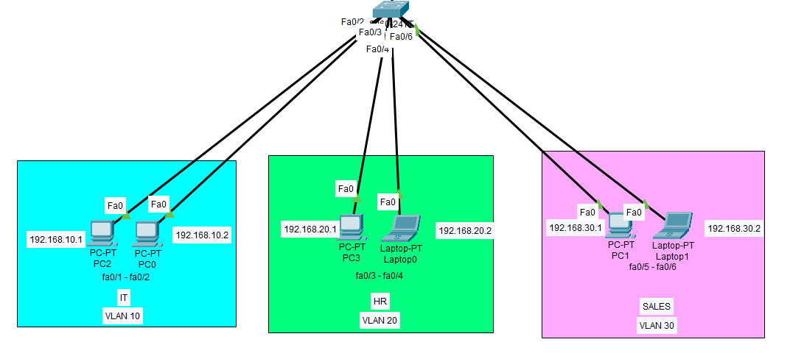

# Basic VLAN Setup for IT, Sales, and HR



**Project Description**:  
This project demonstrates the configuration and management of three VLANs on a Cisco switch. The VLANs segment network traffic for three different departments: IT, Sales, and HR. The project ensures devices within the same VLAN can communicate, but there is no inter-VLAN routing, meaning devices in different VLANs are isolated.

**Technologies Used**:  
- Cisco Packet Tracer
- VLAN Configuration on Cisco Switches
- Basic Network Design and Troubleshooting

## Project Overview

This project focuses on creating a simple VLAN network with three VLANs to separate the traffic of different departments within a company:

- **VLAN 10 (IT)**: Used for IT-related devices.
- **VLAN 20 (Sales)**: Used for Sales-related devices.
- **VLAN 30 (HR)**: Used for HR-related devices.

The project uses **Cisco Packet Tracer** to simulate the network setup. It shows how to:
- Create VLANs on a Cisco switch.
- Assign switch ports to respective VLANs.
- Test connectivity within each VLAN.

There is no inter-VLAN routing configured, so devices in different VLANs cannot communicate with each other.

## CLI Commands
Configuring VLANs on the switch:

- VLAN 10 for IT
- VLAN 20 for Sales
- VLAN 30 for HR

```bash
SW1(config)# vlan 10
SW1(config-vlan)# name IT
SW1(config)# vlan 20
SW1(config-vlan)# name Sales
SW1(config)# vlan 30
SW1(config-vlan)# name HR

SW1(config)# interface range fa0/1-2
SW1(config-if-range)# switchport mode access
SW1(config-if-range)# switchport access vlan 10

SW1(config)# interface range fa0/3-4
SW1(config-if-range)# switchport mode access
SW1(config-if-range)# switchport access vlan 20

SW1(config)# interface range fa0/5-6
SW1(config-if-range)# switchport mode access
SW1(config-if-range)# switchport access vlan 30
```
## Testing and Verification
```bash
SW1# show vlan brief
SW1# show interface status
SW1# show running-config
```
Ping Test:

- PC1 (VLAN 10) should be able to ping PC2 (VLAN 10)
- PC3 (VLAN 20) should be able to ping PC4 (VLAN 20)
- PC5 (VLAN 30) should be able to ping PC6 (VLAN 30)
- PC's in different VLANs should not be able to ping eachother.

